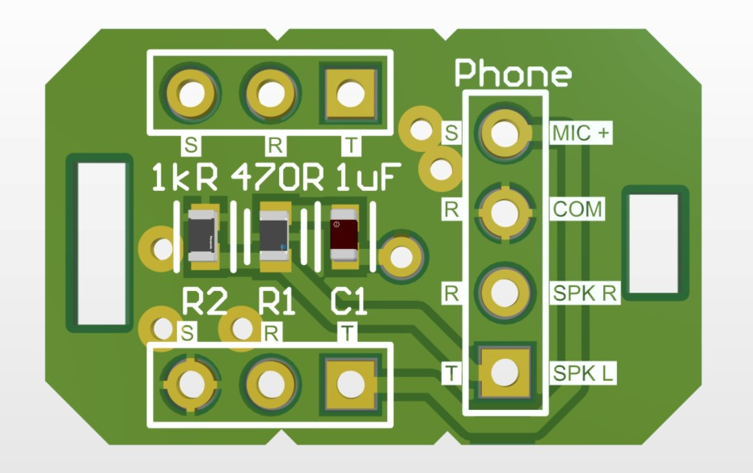
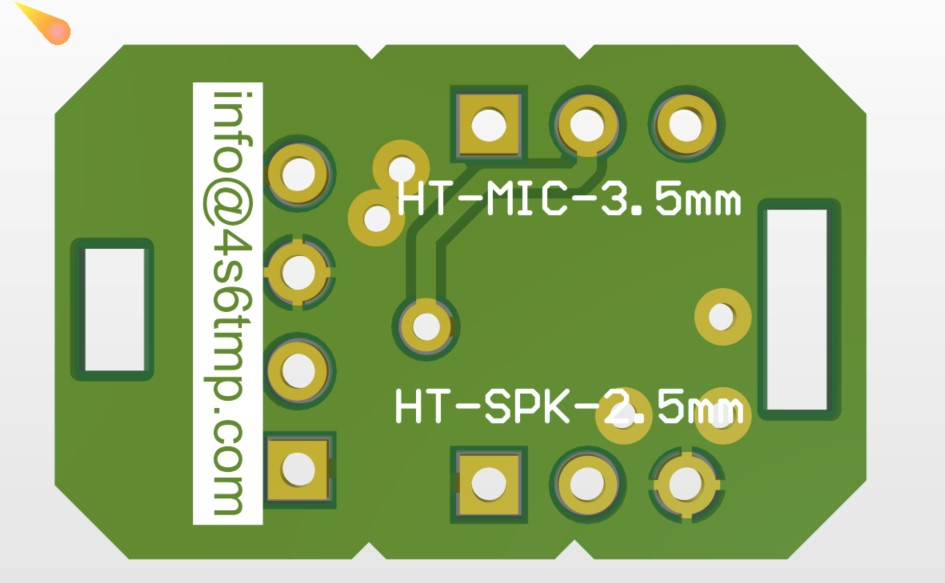

# HT-TRS Interface

This interface allows you to connect your Baofeng/TYT/Kenwood/Yaesu HT to Raspberry Pi USB Sound Card allowing to operate packet radio modes such as APRS or Echolink. 

### Schematic

Manufactured PCB 

### Notes

Board Size	30.5000mm  x   21.8440mm

Wish you good luck!  

73 de 4S6TMP.
